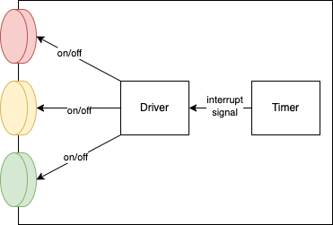
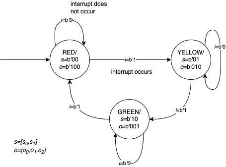
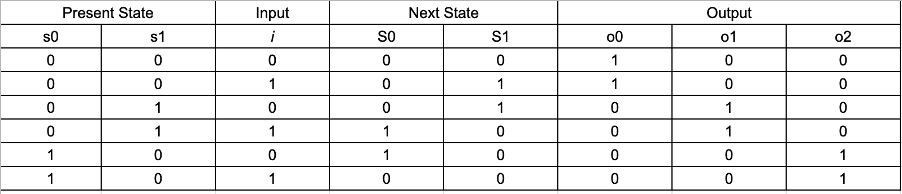
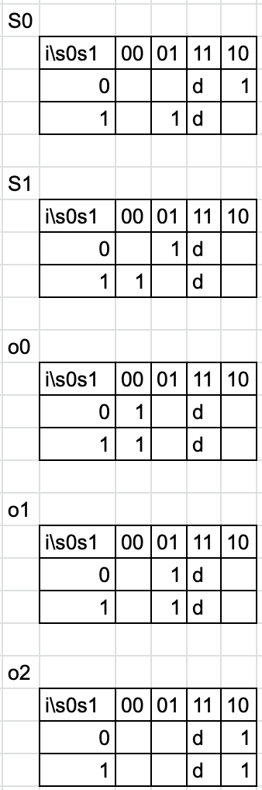
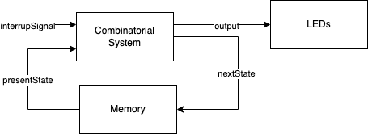

# Simple Traffic Light using FSM

Table of contents:
- [Simple Traffic Light using FSM](#simple-traffic-light-using-fsm)
  - [Instruction](#instruction)
  - [FSM](#fsm)
  - [Transition Table](#transition-table)
  - [Karnaugh Map](#karnaugh-map)
  - [Combinatorial Equations](#combinatorial-equations)
  - [Implementation](#implementation)

## Instruction

A traffic light has three LEDs, i.e., red, yellow, and green.
The traffic light has an internal timer that triggers an interrupt every 3s.
(The timer can send an interrupt signal to a driver, which can turn on/off an LED as shown in the figure below.)
Initially, the light turns red.
But after the timer sends the interrupt signal, the light turns yellow. 
After another 3s, the light turns green. 
Then, it will turn red again after another 3s.

Please simulate and design a traffic light use case defined above by using:
    
- FSM
- Transition table
- Karnaugh map
- Combinatorial equations

and implement it using:

- the equation that you obtain by using K-map
- C language

## FSM

The following is an FSM diagram that represents the traffic light use case. 
Note that all labels are already encoded accordingly.

## Transition Table

From the FSM above, below is the transition table, where all labels are already encoded.

## Karnaugh Map

Based on the transition table above, we can obtain the following Kmap.

## Combinatorial Equations

From the K-map tables above, the following combinatorial equation can be obtained.

$$
    \begin{align}
    S_0 &= s_0\bar{i}+s_1 i \\
    S_1 &= \bar{s_0}\bar{s_1}i+s_1i
    \end{align}
$$

$$
    \begin{align}
    o_0 &= \bar{s_0}\bar{s_1} \\
    o_1 &= s_1 \\
    o_2 &= s_0
    \end{align}
$$

## Implementation

The big idea is that we need to implement the system as depicted below.

